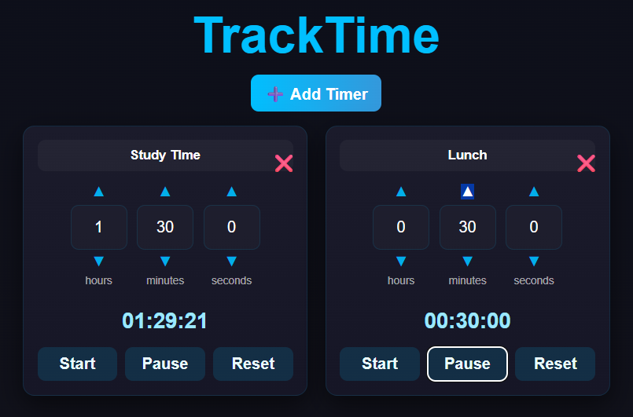

# ⏱️ TrackTime – Multi-Timer App

TrackTime is a **React-based timer application** that lets you create and manage multiple timers side by side.  
Each timer can be customized with a name, hours, minutes, and seconds — and you get notifications when time is up.

---

## ✨ Features

- ➕ **Create multiple timers** on one screen
- 🏷️ **Name each timer** for easy tracking
- ⬆️⬇️ **Adjust hours, minutes, and seconds** using arrow controls or direct typing
- ▶️ **Start, pause, reset (single / double click)**
  - Single click **Reset** → sets time to 0
  - Double click **Reset** → resets everything (inputs + countdown)
- 🔔 **Browser notifications** when time runs out
- 🎨 Clean and modern **UI with low-time warning** (blinking effect when <10s)

---

## 🖼️ Demo Screenshot



---

## 🚀 Getting Started

### Prerequisites

- [Node.js](https://nodejs.org/) (v16 or later recommended)
- [npm](https://www.npmjs.com/) or [yarn](https://yarnpkg.com/)

### Installation

1. Clone the repository:

   ```bash
   git clone https://github.com/your-username/TrackTime-.git
   cd TrackTime-

   ```

2. Installation
   npm install

   # or

   yarn install

3. Start a Development Server
   npm run dev

4. Open at Your Browser

## Roadmap / Future Improvements

⏰ Add alarm sounds when a timer ends

📱 Mobile-friendly responsive layout

💾 Save timers in local storage

🌐 Deploy live on GitHub Pages / Vercel
